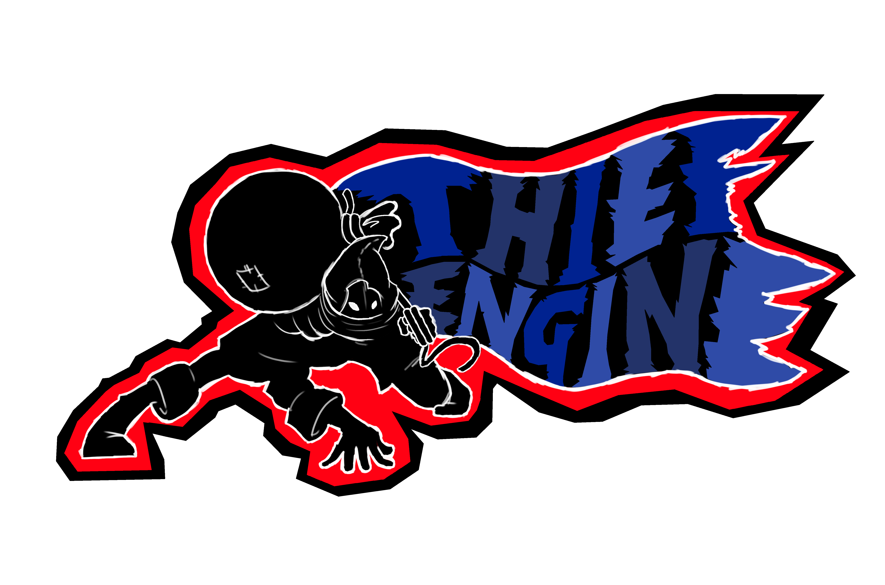

# Thief Engine : 2D Game Engine, written in Javascript and WebGL.

<!--  -->

## About this project

>This Game Engine is developed as Degree's Final Project and it is written in Javascript, WebGL and GLSL. The engine is written from scratch (I'm not crazy, please trust me), no framework was used here, except the WebGL API.

>The goal of this project is to serve as Portfolio, proving that I really have certain game programming related knowledge.

>This is not my first game engine and will not be the last ;). Currently, this is my fourth attempt to create a modest, tiny and lightweight game engine. (I lied, none of the game engine on Earth are tiny). I have tried with C++, Java, Python and now it's the turn of JS.

>The good thing is that I have learned about powerful, complex and weird stuff like Game Engine Architecture, Graphics Engine Architecture, how read huge programming books, Physics Engine Architecture, Collision Detection Algorithms and much more.

>I highly recommend it if you want to really learn about video games internals/game engine programming.

>Well... maybe if you want to learn about algebra, arithmetic, trigonometry, numerical integration/differentiation, vector operations, affine transformations, geometry and physics too. ¯\\\_(ツ)_/¯

>Why did I name it 'Thief Engine'? ¯\\\_(ツ)_/¯

## Features

* Component-Entity-System based
* Custom 2D render engine
* SpriteSheet animation
* Textures Atlas support
* Custom 2D physics/collisions engine

## Test

You can test the engine opening the `test/index.hmtl` file in your browser.

## About the author

See my personal portfolio →
[https://adrianecom.github.io/portfolio/](https://adrianecom.github.io/portfolio/)
